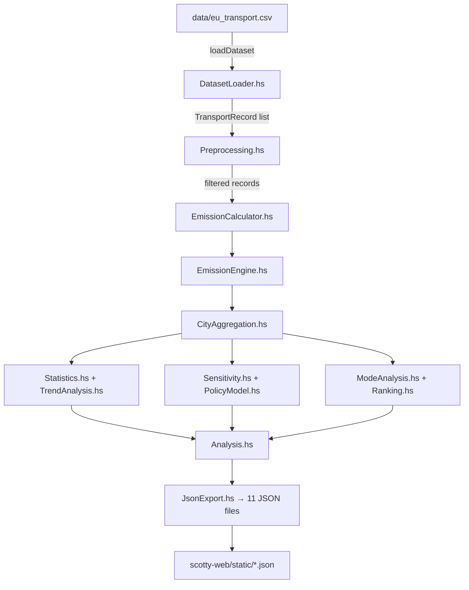

# TransportSense — Complete Project Explanation & Speaker Notes

---

## 📁 1. Project Structure Overview

```
Traffic_Emission/
├── src/                         ← 🧠 Core Haskell Library (18 modules)
│   ├── Types.hs                 ← Data type definitions (ADTs, records)
│   ├── Utils.hs                 ← Shared utility functions
│   ├── DatasetLoader.hs         ← CSV file parser
│   ├── Preprocessing.hs         ← Filtering & data selection
│   ├── EmissionCalculator.hs    ← Per-record emission math
│   ├── EmissionEngine.hs        ← City-level emission aggregation
│   ├── EnergyEngine.hs          ← Energy consumption calculations
│   ├── CityAggregation.hs       ← Aggregate metrics per city-year
│   ├── Statistics.hs            ← OLS Linear Regression, Pearson correlation, Stats
│   ├── Sensitivity.hs           ← Sensitivity / elasticity analysis
│   ├── PolicyModel.hs           ← 5 predefined policy scenarios
│   ├── Simulation.hs            ← Run scenarios across all cities
│   ├── TrendAnalysis.hs         ← CO2/energy trend + slopes
│   ├── ModeAnalysis.hs          ← Modal share matrix & shifts
│   ├── Ranking.hs               ← Rank cities by CO2, green, EV, energy
│   ├── Analysis.hs              ← High-level reports (city, global, continent)
│   ├── Models.hs                ← HOF-based composable emission models
│   └── JsonExport.hs            ← Export all analytics → 11 JSON files
│
├── app/
│   └── Main.hs                  ← CLI entry point (interactive menu + commands)
│
├── cli/
│   ├── CLI.hs                   ← Command-line argument parser & runner
│   └── Menu.hs                  ← Interactive terminal menu system
│
├── csvtojson/
│   └── Main.hs                  ← Standalone CSV → JSON converter (uses Aeson/Cassava)
│
├── data/
│   └── eu_transport.csv         ← Source dataset (196 countries × 16 years)
│
├── scotty-web/                  ← 🌐 Web Server (Haskell Scotty Framework)
│   ├── app/
│   │   └── Web.hs               ← Scotty web server — routes, JSON serving
│   ├── src/
│   │   └── Lib.hs               ← Placeholder library module
│   ├── static/                  ← 🎨 Frontend (HTML/CSS/JS)
│   │   ├── index.html           ← Landing page (animated hero, features)
│   │   ├── sign.html            ← Sign In / Sign Up page (Firebase Auth)
│   │   ├── dashboard.html       ← Main dashboard (8 pages, 20+ charts, AI chat)
│   │   ├── analysis.json        ← Pre-computed analytics data
│   │   ├── emissions_Africa.json
│   │   ├── emissions_Antarctica.json
│   │   ├── emissions_Asia.json
│   │   ├── emissions_Australia.json
│   │   ├── emissions_North_America.json
│   │   ├── emissions_South_America.json
│   │   └── img/                 ← Images, logos
│   ├── package.yaml             ← Stack/Hpack config for scotty-web
│   ├── scotty-web.cabal         ← Auto-generated cabal file
│   ├── stack.yaml               ← Haskell Stack resolver config
│   └── stack.yaml.lock          ← Locked dependency versions
│
├── test/                        ← Unit tests
│   ├── DatasetTest.hs
│   ├── EmissionTest.hs
│   └── SimulationTest.hs
│
├── docs/                        ← Technical documentation
│   ├── architecture.md
│   ├── dataset_description.md
│   └── formulas.md
│
├── documentation/               ← Academic deliverables
│   ├── SN.pdf
│   ├── TransportSense_PFL.pptx
│   └── Transport_Emissions_IEEE_Paper.pdf
│
├── Dockerfile                   ← Docker config (nginx-based deployment)
├── transport-emissions.cabal    ← Root Cabal build file
├── README.md                    ← Project documentation
├── LICENSE                      ← MIT License
└── .gitattributes               ← Git line-ending config
```

---

## 📂 2. What Every File & Folder Does (One by One)

### Root-Level Files

| File | What It Does |
|------|-------------|
| [transport-emissions.cabal](file:///c:/Main/College/College_Stuff/SEM-4/PFL/Traffic_Emission/transport-emissions.cabal) | The **build configuration** for the entire Haskell project. Lists all 18 source modules, the CLI executable, the csvtojson executable, and the test suite. Specifies dependencies like [base](file:///c:/Main/College/College_Stuff/SEM-4/PFL/Traffic_Emission/scotty-web/static/dashboard.html#1121-1130), `directory`, `containers`. |
| [Dockerfile](file:///c:/Main/College/College_Stuff/SEM-4/PFL/Traffic_Emission/Dockerfile) | Defines how to **containerize** the app for deployment. Uses `nginx:alpine` base image, copies the `static/` files into nginx's serving directory, and dynamically injects the `PORT` env variable at runtime. |
| [README.md](file:///c:/Main/College/College_Stuff/SEM-4/PFL/Traffic_Emission/README.md) | Project documentation — explains features, tech stack, setup instructions, and deployment. |
| [LICENSE](file:///c:/Main/College/College_Stuff/SEM-4/PFL/Traffic_Emission/LICENSE) | MIT License file. |
| [.gitattributes](file:///c:/Main/College/College_Stuff/SEM-4/PFL/Traffic_Emission/.gitattributes) | Configures Git to handle line endings consistently (`* text=auto`). |
| [.gitignore](file:///c:/Main/College/College_Stuff/SEM-4/PFL/Traffic_Emission/.gitignore) | Tells Git which files to ignore (build artifacts, `.stack-work`, etc.). |
| [test.hs](file:///c:/Main/College/College_Stuff/SEM-4/PFL/Traffic_Emission/test.hs) | A quick standalone test script. |
| [package-lock.json](file:///c:/Main/College/College_Stuff/SEM-4/PFL/Traffic_Emission/package-lock.json) | npm lock file (for any Node.js tooling). |

---

### `src/` — The 18 Haskell Backend Modules (Core Library)

#### 1. [Types.hs](file:///c:/Main/College/College_Stuff/SEM-4/PFL/Traffic_Emission/src/Types.hs) — Data Type Definitions
- Defines **ALL** the core data types using Haskell's **Algebraic Data Types (ADTs)**:
  - `TransportMode` — An **enum** with 7 modes: `Car | Motorcycle | ElectricCar | Bus | Rail | Walk | Bicycle`
  - `TransportRecord` — A **record type** with 13 fields (city, country, continent, population, year, mode, modal share, trip km, daily trips, emission factors for CO2/NOx/PM10, energy intensity)
  - `CityMetrics` — Aggregated metrics per city-year (total CO2, NOx, PM10, energy, low-carbon share, etc.)
  - `SensitivityResult` — Result of perturbing a parameter (elasticity analysis)
  - `PolicyScenario` — A named scenario with modal share shifts
  - `ScenarioResult` — Result of applying a scenario (base vs new CO2)
  - `Stats` — Statistical summary (mean, stddev, min, max, median)
  - `TrendPoint` — A single data point for a trend line
  - `ModeShiftResult` — Change in modal share between two years
  - `RankEntry` — A ranked city entry with score
- Also provides helper functions: `parseModeStr`, `modeLabel`, `isLowCarbon`
- **FP Concepts Used**: ADTs, pattern matching, deriving (Show, Eq, Ord, Enum, Bounded)

#### 2. [Utils.hs](file:///c:/Main/College/College_Stuff/SEM-4/PFL/Traffic_Emission/src/Utils.hs) — Shared Utility Functions
- `safeDiv` — Division that returns 0 when dividing by 0 (prevents crashes)
- `roundTo` — Rounds a Double to N decimal places
- `groupByKey` — Groups a list by a key function using **higher-order functions (HOFs)**
- `splitOn` — Splits a string on a delimiter (used for CSV parsing)
- `parseDouble` — Parses numeric strings including scientific notation (e.g., `6.55E-05`)
- `pctChange` — Calculates percentage change between two values
- `weightedMean` — Calculates a weighted average
- `normalise` — Normalises a list of values to [0,1] range
- `ciEq` — Case-insensitive string comparison
- **FP Concepts**: Higher-order functions, `foldr`, immutability

#### 3. [DatasetLoader.hs](file:///c:/Main/College/College_Stuff/SEM-4/PFL/Traffic_Emission/src/DatasetLoader.hs) — CSV Parser
- `loadDataset :: FilePath -> IO [TransportRecord]` — Reads a CSV file from disk, parses it into records
- `loadDatasetFromString :: String -> [TransportRecord]` — Parses CSV **from a string** (for testing/web use)
- `parseRecord :: String -> Maybe TransportRecord` — Parses a **single CSV line** using pattern matching on the split result. Returns `Maybe` (either `Just record` or `Nothing` for malformed lines)
- Uses `mapMaybe` to skip malformed lines silently
- **FP Concepts**: `Maybe` monad, do-notation, `mapMaybe`, pattern matching

#### 4. [Preprocessing.hs](file:///c:/Main/College/College_Stuff/SEM-4/PFL/Traffic_Emission/src/Preprocessing.hs) — Data Filtering & Selection
- Pure filter functions using **higher-order functions**:
  - `filterByCity`, `filterByYear`, `filterByContinent`, `filterByMode`, `filterByYearRange`
- List extraction: `getCities`, `getYears`, `getContinents`, `getModes`
- `recordsForCityYear` — Gets all records for a specific (city, year) pair
- `normaliseShares` — Renormalises modal shares to sum to 100%
- **FP Concepts**: Function composition (`.`), `filter`, `map`, point-free style

#### 5. [EmissionCalculator.hs](file:///c:/Main/College/College_Stuff/SEM-4/PFL/Traffic_Emission/src/EmissionCalculator.hs) — Per-Record Emission Math
- `pkm :: TransportRecord -> Double` — Calculates **passenger-kilometres** per person per day:
  ```
  pkm = (modalShare / 100) × dailyTrips × avgTripKm
  ```
- `emissionContribution :: (TransportRecord -> Double) -> TransportRecord -> Double` — A **higher-order function** that takes an emission factor selector function and multiplies it by PKM
- `dailyCO2PerCapita`, `dailyNOxPerCapita`, `dailyPM10PerCapita`, `dailyEnergyPerCapita` — Specific emission calculations using `emissionContribution`
- **FP Concepts**: HOFs (functions as parameters), partial application, point-free style

#### 6. [EmissionEngine.hs](file:///c:/Main/College/College_Stuff/SEM-4/PFL/Traffic_Emission/src/EmissionEngine.hs) — City-Level Emission Aggregation
- `sumEmission :: (TransportRecord -> Double) -> [TransportRecord] -> Double` — HOF that sums any emission function over a list of records
- `cityTotalCO2`, `cityTotalNOx`, `cityTotalPM10`, `cityTotalEnergy` — Total emissions per day for a city
- `modeEmissionShare` — What fraction of total CO2 is from a specific transport mode
- `cityDailyCO2Tonnes` — Total daily CO2 for the whole city population (multiplies per-capita by population, converts to tonnes)
- **FP Concepts**: HOFs, function composition, `sum . map`

#### 7. [EnergyEngine.hs](file:///c:/Main/College/College_Stuff/SEM-4/PFL/Traffic_Emission/src/EnergyEngine.hs) — Energy Calculations
- `energyUse :: TransportRecord -> Double` — Energy for one mode record
- `totalEnergy :: [TransportRecord] -> Double` — Sum of energy across all modes
- **FP Concepts**: Function composition (`sum . map`)

#### 8. [CityAggregation.hs](file:///c:/Main/College/College_Stuff/SEM-4/PFL/Traffic_Emission/src/CityAggregation.hs) — City-Year Aggregation
- `aggregateCity :: [TransportRecord] -> Maybe CityMetrics` — Takes all transport records for a single city-year and produces one `CityMetrics` summary
- `aggregateAll :: [TransportRecord] -> [CityMetrics]` — Aggregates **all** city-year combinations in the dataset
- `cityYearPairs` — Extracts all unique (city, year) pairs
- **FP Concepts**: `Maybe` for safe handling of empty lists, list comprehensions, `map`, `filter`

#### 9. [Statistics.hs](file:///c:/Main/College/College_Stuff/SEM-4/PFL/Traffic_Emission/src/Statistics.hs) — Statistical Functions ⭐ (Contains Linear Regression)
- `computeStats :: [Double] -> Stats` — Computes mean, standard deviation, min, max, median
- `pearsonCorrelation :: [Double] -> [Double] -> Double` — Pearson R correlation coefficient
- **`linearRegression :: [Double] -> [Double] -> (Double, Double)`** — **OLS (Ordinary Least Squares) linear regression** implemented from scratch (no library!):
  ```
  slope = Σ[(xi - x̄)(yi - ȳ)] / Σ[(xi - x̄)²]
  intercept = ȳ - slope × x̄
  ```
  Returns [(intercept, slope)](file:///c:/Main/College/College_Stuff/SEM-4/PFL/Traffic_Emission/scotty-web/static/dashboard.html#1853-1875)
- `zScore` — Calculates Z-score of a value relative to a Stats distribution
- **FP Concepts**: List comprehensions, `zip`, `sum`, safe division

#### 10. [Sensitivity.hs](file:///c:/Main/College/College_Stuff/SEM-4/PFL/Traffic_Emission/src/Sensitivity.hs) — Sensitivity & Elasticity Analysis
- `modalShareSensitivity` — Perturbs a mode's share by +Δ percentage points and measures how CO2 changes
- `efSensitivity` — Perturbs emission factors by a relative percentage and measures CO2 change
- `elasticity` — Calculates dimensionless elasticity: [(dOutput/Output) / (dInput/Input)](file:///c:/Main/College/College_Stuff/SEM-4/PFL/Traffic_Emission/scotty-web/static/dashboard.html#1853-1875)
- `runAllSensitivities` — Runs both analyses for all modes (7 modal share + 3 EF tests = 10 results per city-year)
- **FP Concepts**: HOFs, list comprehensions using `[Car .. Bicycle]` enum range, pattern matching

#### 11. [PolicyModel.hs](file:///c:/Main/College/College_Stuff/SEM-4/PFL/Traffic_Emission/src/PolicyModel.hs) — Policy Scenario Simulation
- `applyScenario` — Takes a PolicyScenario and applies its modal share shifts to records, then renormalises
- `runScenarioForCity` — Applies a scenario to a specific city-year and computes base vs new CO2/energy
- `predefinedScenarios` — 5 built-in policy scenarios:
  1. **Rail Push** — +10% rail, -10% car
  2. **EV Transition** — +10% electric car, -10% car
  3. **Active Mobility** — +5% walk, +5% cycle, -10% motorcycle
  4. **Bus Rapid Transit** — +8% bus, -8% car
  5. **Zero Car City** — -20% car, +10% rail, +10% EV
- **FP Concepts**: `foldl'` for strict left fold, HOFs, record update syntax

#### 12. [Simulation.hs](file:///c:/Main/College/College_Stuff/SEM-4/PFL/Traffic_Emission/src/Simulation.hs) — Simulation Runner
- `simulateCityScenarios` — Runs all 5 scenarios for one city-year
- `simulateAllCities` — Runs all 5 scenarios for **every** city-year combination
- `bestScenarioPerCity` — Finds the scenario with the highest CO2 reduction per city
- **FP Concepts**: List comprehensions, `minimumBy`, `comparing`

#### 13. [TrendAnalysis.hs](file:///c:/Main/College/College_Stuff/SEM-4/PFL/Traffic_Emission/src/TrendAnalysis.hs) — Trend Analysis
- `co2Trend`, `energyTrend` — Extract CO2/energy trend points for a city over time
- `modalShareTrend` — Track how a specific mode's share changes over years
- `trendSlope` — Uses [linearRegression](file:///c:/Main/College/College_Stuff/SEM-4/PFL/Traffic_Emission/scotty-web/static/dashboard.html#1667-1674) from Statistics.hs to calculate the **OLS slope** of a trend (units per year)
- `allCityTrends` — Summarises CO2 trends for all cities: (city, slope, 2015 value, 2020 value)
- **FP Concepts**: List comprehensions, `sortBy`, `comparing`, function composition

#### 14. [ModeAnalysis.hs](file:///c:/Main/College/College_Stuff/SEM-4/PFL/Traffic_Emission/src/ModeAnalysis.hs) — Modal Share Analysis
- `modeShareMatrix` — Modal share for every mode in a city-year
- `modeShifts` — How modal shares changed between two years for a city
- `dominantMode` — Which mode has the highest share
- `lowCarbonShares` — Green transport percentage per city-year
- `modeEmissionBreakdown` — CO2 breakdown by mode with percentages
- **FP Concepts**: `maximumBy`, `comparing`, list comprehensions, `lookup`

#### 15. [Ranking.hs](file:///c:/Main/College/College_Stuff/SEM-4/PFL/Traffic_Emission/src/Ranking.hs) — City Rankings
- `rankBy` — Generic ranking HOF that sorts by any metric
- `rankByCO2` — Rank by lowest CO2 (lower is better)
- `rankByLowCarbon` — Rank by highest green share (higher is better)
- `rankByEVShare` — Rank by electric vehicle adoption
- `rankByEnergy` — Rank by lowest energy consumption
- **FP Concepts**: HOFs, `zipWith`, `sortBy`, `comparing`, `negate` for reverse sorting

#### 16. [Analysis.hs](file:///c:/Main/College/College_Stuff/SEM-4/PFL/Traffic_Emission/src/Analysis.hs) — High-Level Reports
- `fullCityReport` — Deep-dive into a single city-year: metrics + emission breakdown
- `globalSummary` — Global statistical summary (stats for CO2, energy, low-carbon share)
- `continentSummary` — Average metrics per continent
- `correlationReport` — Pearson correlations: car share vs CO2, rail share vs CO2, etc.
- **FP Concepts**: `Maybe` for safe report generation, `groupBy`, `sortBy`

#### 17. [Models.hs](file:///c:/Main/College/College_Stuff/SEM-4/PFL/Traffic_Emission/src/Models.hs) — Composable Emission Models ⭐ (Advanced FP)
- `EmissionModel` — A **newtype wrapper** around `[TransportRecord] -> Double`, representing an emission model as a function
- `linearModel` — Sum of emissions (simplest model)
- `weightedModel` — Each mode's emission is weighted by a mode-specific factor
- `sensitivityModel` — Computes the **delta** between a base model and a perturbed model
- `applyModel` — Run any model on data
- **Semigroup instance** — `model1 <> model2` adds their outputs
- **Monoid instance** — `mempty` is a model that always returns 0
- **FP Concepts**: `newtype`, typeclasses (`Semigroup`, `Monoid`), HOFs, function-as-data, composition of computation

#### 18. [JsonExport.hs](file:///c:/Main/College/College_Stuff/SEM-4/PFL/Traffic_Emission/src/JsonExport.hs) — JSON Export Engine
- `exportAllJson` — Exports **11 JSON files** to a directory:
  1. `city_metrics.json`, `mode_shares.json`, `emission_breakdown.json`
  2. `trends.json`, `sensitivity.json`, `scenarios.json`
  3. `rankings.json`, `global_summary.json`, `continent_summary.json`
  4. `correlations.json`, `mode_shifts.json`
- Implements a `ToJson` typeclass and manual JSON serialization (no library dependency)
- **FP Concepts**: Typeclasses, `map`, list comprehensions, string interpolation via concatenation

---

### [app/Main.hs](file:///c:/Main/College/College_Stuff/SEM-4/PFL/Traffic_Emission/app/Main.hs) — CLI Entry Point
- The **main** function: loads the dataset, checks command-line arguments
- If no arguments → launches **interactive menu** (from [Menu.hs](file:///c:/Main/College/College_Stuff/SEM-4/PFL/Traffic_Emission/cli/Menu.hs))
- If arguments given → parses them and runs the corresponding CLI command
- `extractCsvPath` — Checks if the last argument is a [.csv](file:///c:/Main/College/College_Stuff/SEM-4/PFL/Traffic_Emission/data/eu_transport.csv) file to override the default data path

### [cli/CLI.hs](file:///c:/Main/College/College_Stuff/SEM-4/PFL/Traffic_Emission/cli/CLI.hs) — Command Parser & Runner
- Defines `CLICommand` ADT with 13 commands (cities, city, global, continent, rank, sensitivity, etc.)
- `parseArgs` — Pattern matches on command-line strings to produce a `CLICommand`
- `runCLI` — Executes each command by calling the appropriate library functions and printing results
- Includes table formatting utilities (`tableFormat`, `pad`, `transpose'`)

### [cli/Menu.hs](file:///c:/Main/College/College_Stuff/SEM-4/PFL/Traffic_Emission/cli/Menu.hs) — Interactive Menu
- `runMenu` — Launches an interactive terminal menu with numbered options
- Sub-menus for: Rankings, City Deep-Dive, Scenario Simulation
- `cityMenu` — Lists all cities, lets user pick one and a year
- `cityDeepDive` — Full report, sensitivity, or scenarios for a chosen city-year

### [csvtojson/Main.hs](file:///c:/Main/College/College_Stuff/SEM-4/PFL/Traffic_Emission/csvtojson/Main.hs) — CSV to JSON Converter
- A standalone Haskell executable that uses the **Aeson** (JSON) and **Cassava** (CSV) libraries
- Reads [data/eu_transport.csv](file:///c:/Main/College/College_Stuff/SEM-4/PFL/Traffic_Emission/data/eu_transport.csv) and writes `data/jsonfile/eu_transport.json`
- Converts each CSV row into a JSON object using the header names as keys

---

### `scotty-web/` — Web Server

#### [scotty-web/app/Web.hs](file:///c:/Main/College/College_Stuff/SEM-4/PFL/Traffic_Emission/scotty-web/app/Web.hs) — The Scotty Web Server
- Starts a **Scotty HTTP server** on a configurable port (default 3000, reads `PORT` env var)
- Routes:
  - `GET /` → serves [static/index.html](file:///c:/Main/College/College_Stuff/SEM-4/PFL/Traffic_Emission/scotty-web/static/index.html) (landing page)
  - `GET /sign.html` → sign in page
  - `GET /dashboard.html` → main dashboard
  - **Dynamically discovers** all [.json](file:///c:/Main/College/College_Stuff/SEM-4/PFL/Traffic_Emission/src/package.json) files in `static/` and creates routes for each one
  - `GET /analysis` and `GET /api/analysis` → analysis.json
- Also includes a `csvToJson` utility function for converting CSV data to JSON on-the-fly
- Sets CORS headers (`Access-Control-Allow-Origin: *`)

#### `scotty-web/static/` — The Frontend

| File | Purpose |
|------|---------|
| `index.html` | **Landing page** — Hero section, feature cards, tech stack strip, animated particle system, custom cursor, scroll reveal animations |
| `sign.html` | **Authentication page** — Sign In/Sign Up with Firebase Authentication |
| `dashboard.html` | **Main dashboard** — Contains 8 pages (Global Overview, Sensitivity, Compare, Modal Share, Time Animation, Calculator, Import, AI Prediction), 20+ Chart.js charts, dark/light mode, glassmorphism UI, particle background |
| `analysis.json` | Pre-computed analysis data served to the dashboard |
| `emissions_*.json` | Continent-specific emission data files (6 continents) |
| `img/` | Logo and image assets |

---

### `test/` — Test Suite

| File | Tests |
|------|-------|
| `DatasetTest.hs` | Tests CSV parsing, record validation, filtering functions |
| `EmissionTest.hs` | Tests emission calculations, aggregation correctness |
| `SimulationTest.hs` | Tests policy scenarios, sensitivity, rankings |

### `docs/` — Technical Documentation

| File | Contents |
|------|----------|
| `architecture.md` | System architecture, module dependency diagram |
| `dataset_description.md` | Description of the CSV dataset schema and fields |
| `formulas.md` | All mathematical formulas used (PKM, CO2, elasticity, OLS regression, etc.) |

---

## 🔗 3. How Everything Connects — Major Parts

### 3.1 Backend — Haskell (.hs files)



**Flow**: CSV → Parse → Filter → Calculate → Aggregate → Analyse → Export JSON → Serve on web

### 3.2 Frontend — HTML, CSS, JS

- **`index.html`** (Landing Page):
  - Pure HTML/CSS/JS — zero framework dependency
  - Animated particle system (canvas-based, mouse-responsive)
  - Custom cursor with crosshair effect
  - Feature cards with scroll-reveal animations
  - Links to `sign.html` for authentication

- **`sign.html`** (Authentication):
  - Firebase Authentication (Google Sign-In / Email+Password)
  - Redirects to `dashboard.html` after login

- **`dashboard.html`** (Main Dashboard — ~1900 lines!):
  - **8 navigable pages** in a single-page app (SPA) design:
    1. Global Overview — KPIs, continent charts, trend lines, full data table
    2. Sensitivity Analysis — Per-country CO2 breakdown, emission factors, modal shift comparison
    3. Country Compare — Side-by-side country metrics (CO2, green, fossil, car, rail, etc.)
    4. Modal Share — Horizontal bar rankings for Car, Rail, Bus, Motorcycle, Walking, Cycling, EV
    5. Time Animation — Animated year-by-year bar charts with play/pause, CO2 delta, trend line
    6. Emission Calculator — Interactive sliders for custom modal splits, PDF/CSV export
    7. Import Dataset — Drag-and-drop JSON import → instant mini-dashboard
    8. AI Prediction — Linear regression forecasting + AI chatbot
  - **Chart.js** for all visualizations (bar, line, doughnut, horizontal bar)
  - **Dark/light theme** toggle with CSS variables
  - **Glassmorphism** UI (frosted glass effect with backdrop-filter)
  - **Animated particle background** on dashboard too

### 3.3 Docker, Railway, Scotty

#### What is Docker?
- Docker is a **containerization** tool. Think of it as a lightweight virtual machine that packages your app + all its dependencies into a single "container" that runs identically everywhere.
- **Why use it?** So the app works the same on your laptop, your teammate's laptop, and the production server — no "it works on my machine" problems.

#### What the Dockerfile Does:
```dockerfile
FROM nginx:alpine                      # Uses a lightweight nginx web server as base
COPY scotty-web/static /usr/share/nginx/html  # Copies all static files into nginx
# Configures nginx to:
#   - Serve index.html for all routes (SPA behavior)
#   - Set correct Content-Type for .json files
#   - Read PORT from Railway's environment variable
CMD sh -c "sed s/NGINX_PORT/$PORT/g ... && nginx -g 'daemon off;'"
```
> [!NOTE]
> The production Dockerfile uses **nginx** (not Scotty) because for static files, nginx is much faster and more efficient. Scotty is used for **local development** only.

#### What is Scotty?
- Scotty is a **lightweight Haskell web framework** (like Express.js for Node.js, or Flask for Python)
- It lets you define HTTP routes in Haskell:
  ```haskell
  get "/" $ file "static/index.html"
  get "/dashboard.html" $ file "static/dashboard.html"
  ```
- **Why Scotty?** Because the project's backend language is Haskell — Scotty keeps everything in one language. It's minimal (~100 lines for the whole server), fast, and serves both HTML pages and JSON data.
- In development: `stack run` starts Scotty on `localhost:3000`

#### What is Railway?
- Railway is a **cloud deployment platform** (like Heroku or Vercel) that:
  1. Connects to your GitHub repo
  2. Detects the Dockerfile
  3. Builds the Docker image in the cloud
  4. Deploys it and gives you a **live URL** (e.g., `https://transportsense.up.railway.app`)
- **Why Railway?** Free tier, automatic CI/CD (push to GitHub → auto-deploys), easy Docker support

### 3.4 GitHub Pages
- Used for hosting the **static frontend** separately (as a backup/alternative to Railway)
- `index.html` serves as the entry point on GitHub Pages
- The JSON data files are also hosted alongside the HTML
- This is why `landing.html` was renamed to `index.html` — GitHub Pages requires `index.html` as the root file

---

## 🤖 4. How the AI Features Work

### 4.1 Linear Regression (Forecasting) — Where & How

**Backend Implementation** (in `src/Statistics.hs`):
```haskell
linearRegression :: [Double] -> [Double] -> (Double, Double)
linearRegression xs ys =
    let n   = fromIntegral (length xs)
        mx  = sum xs / n
        my  = sum ys / n
        num = sum [ (x - mx) * (y - my) | (x,y) <- zip xs ys ]
        den = sum [ (x - mx)^2 | x <- xs ]
        slope     = num / den
        intercept = my - slope * mx
    in (intercept, slope)
```

**Frontend Implementation** (in `dashboard.html`, line ~1668):
```javascript
function linearRegression(pts) {
  let n = pts.length, sx = 0, sy = 0, sxy = 0, sxx = 0;
  pts.forEach(({x, y}) => { sx += x; sy += y; sxy += x * y; sxx += x * x; });
  const slope = (n * sxy - sx * sy) / (n * sxx - sx * sx);
  const intercept = (sy - slope * sx) / n;
  return { slope, intercept, predict: x => slope * x + intercept };
}
```

> [!IMPORTANT]
> Linear regression is implemented **from scratch — no library is used**. It is implemented in **two places**:
> 1. **Backend** (`Statistics.hs`) — used for Haskell CLI trend analysis
> 2. **Frontend** (`dashboard.html`) — used for the AI Prediction page forecasting

**How the forecast works:**
1. User selects a **country** and a **metric** (CO₂, Green Score, or Motorisation Rate)
2. Historical data points are extracted: `[(year, value), ...]` for years 2010–2025
3. `linearRegression()` computes the OLS slope and intercept
4. The model **predicts** values for 2026–2035 using: `predicted = slope × year + intercept`
5. A Chart.js line chart shows historical (solid line) + forecast (dashed line)
6. KPI cards display: Current value, Predicted 2030 value, and Projected % change

### 4.2 AI Chatbot — How Llama 3.1 Works

**Architecture:**
```
User Question → Frontend JS → Build System Prompt + Compressed Dataset Payload
    → API Call to Groq (https://api.groq.com/openai/v1/chat/completions)
    → Llama 3.1-8B-instant processes prompt
    → Response streamed back → Displayed in chat UI
```

**Key: Context-Grounded AI (No Hallucinations)**

The AI doesn't have prior knowledge about your specific dataset. Instead, at **query time**, the frontend:

1. **Compresses the entire dataset** into a single string:
   ```javascript
   function getSystemContext() {
     const payload = data.map(r => 
       `${r.country}(${r.continent}):${r.co2.toFixed(2)}kg,${r.greenScore.toFixed(0)}%`
     ).join(' | ');
     // Example: "Germany(Europe):3.45kg,42% | India(Asia):1.23kg,67% | ..."
   }
   ```

2. **Injects this compressed payload** into the system prompt along with rules:
   ```
   You are the TransportSense AI Assistant. Answer based ONLY on the provided dataset.
   Context: 196 countries, Avg CO2: 2.85 kg, Avg Green Score: 45.2%
   Dataset: Germany(Europe):3.45kg,42% | India(Asia):1.23kg,67% | ...
   Rules:
   1. "Most polluted" = HIGHEST CO2
   2. "Greenest" = HIGHEST Green Score
   3. If country not in list, say so
   ```

3. Sends this as the `system` message to the **Groq API** (which hosts Llama 3.1):
   ```javascript
   const res = await fetch('https://api.groq.com/openai/v1/chat/completions', {
     method: 'POST',
     headers: {
       'Content-Type': 'application/json',
       'Authorization': `Bearer ${groqApiKey}`
     },
     body: JSON.stringify({
       model: 'llama-3.1-8b-instant',
       messages: [
         { role: 'system', content: systemContext },
         { role: 'user', content: userQuestion }
       ]
     })
   });
   ```

**Why Groq?** Groq is a cloud API that hosts open-source LLMs (like Llama 3.1) with extremely fast inference. It's free to use (no credit card needed), and the API key is stored in the user's browser `localStorage`.

**Why the AI reads from both "dataset" and "global files":**
- The AI reads from the **currently-loaded dataset** (whatever is on the dashboard)
- If the user imports a custom JSON file, the AI **automatically reads that imported data** instead
- The "global files" are the `emissions_*.json` files (one per continent) loaded at boot

> [!TIP]
> The key innovation is **payload injection** — the entire dataset is compressed and embedded in the LLM's system prompt at query time, so the AI is forced to answer from actual data, eliminating hallucinations.

---

## 🎤 5. Speaker Notes for Presentation Slides

Below are clear, easy-to-deliver speaker notes for each slide visible in your attached image.

---

### Slide: "Contributions"

> **Speaker Notes:**
>
> "Our project has five major contributions. First, the Haskell Backend—we wrote approximately 35,000 bytes of pure Haskell source code spanning 18 modules. We used core functional programming concepts like Higher-Order Functions, Algebraic Data Types, pattern matching, and guards to build a composable emission modelling engine.
>
> Second, the Global Dashboard—it covers 196 countries across 16 years of data. There are 8 interactive pages and over 20 Chart.js visualizations. The UI features a theme-aware design that adapts chart colors between dark and light modes.
>
> Third, Policy Simulation—we implemented 5 predefined scenarios including Rail Push, EV Transition, Active Mobility, Bus Rapid Transit, and Zero Car City. Each scenario automatically calculates the CO2 reduction percentage compared to the baseline.
>
> Fourth, Context-Grounded AI—we inject a compressed version of the entire dataset into the LLM's system prompt at query time. This means the chatbot can only answer based on the actual data, which eliminates hallucination.
>
> Fifth, Custom Forecasting and Import—we built a from-scratch linear regression engine that predicts trends up to 2035, and we support drag-and-drop CSV-to-JSON conversion so users can import their own datasets and instantly see analytics."

---

### Slide: "Novelty of the Proposed System"

> **Speaker Notes:**
>
> "What makes this project novel is the combination of Haskell and functional programming for a real-world application.
>
> First—to our knowledge, this is the first project that uses Haskell's functional programming features—specifically Higher-Order Functions, Algebraic Data Types, pattern matching, functors, and composable modules—to build a modular emission calculation system. Our 18 modules are independently composable, meaning you can mix and match the emission calculator, sensitivity analyser, and policy simulator as building blocks.
>
> Second—our AI assistant is context-grounded. We compress the dataset and feed it directly into Llama 3.1's system prompt. The LLM doesn't use its training data—it is forced to answer from our tabular transport data. This eliminates hallucinations entirely.
>
> Third—users can drag-and-drop any JSON file matching our schema, and the system instantly generates a complete localised mini-dashboard with charts, tables, and KPIs. There's no server processing needed—it's all done client-side.
>
> Fourth—our linear regression forecasting engine is implemented from scratch. We didn't use a library. We wrote the OLS (Ordinary Least Squares) formula ourselves in both Haskell and JavaScript. It predicts CO2 per capita, Green Score, and Motorisation trends by country up to 2035."

---

### Slide: "System Design and Modules"

> **Speaker Notes:**
>
> "Our system has four main components.
>
> **Component 1: Haskell Backend Engine** — This is the core computational layer. It consists of 18 Haskell modules stored in the `src/` directory. The flow starts with `Types.hs` which defines all our data structures like `TransportRecord` and `CityMetrics`. Then `DatasetLoader.hs` parses the CSV file. `Preprocessing.hs` handles filtering. `EmissionCalculator.hs` and `EmissionEngine.hs` compute emissions per mode and per city. `Sensitivity.hs` does elasticity analysis. `PolicyModel.hs` defines 5 policy scenarios. `Statistics.hs` contains our from-scratch linear regression. And `JsonExport.hs` exports everything into 11 JSON files that the frontend consumes.
>
> **Component 2: Interactive Frontend** — This is a zero-dependency vanilla JavaScript frontend. No React, no Vue—just pure HTML, CSS, and JS. We use Chart.js for all visualizations—bar charts, line charts, doughnut charts, stacked charts. The UI uses glassmorphism design with animated particle backgrounds. There are 8 dashboard pages and the design supports both dark and light themes.
>
> **Component 3: AI Prediction Engine** — This has two parts. The first is our client-side OLS linear regression that forecasts 10-year trends. The second is the AI chatbot powered by Llama 3.1 via the Groq API. We inject a compressed dataset payload into the system prompt so the AI only answers from real data, not from its training data.
>
> **Component 4: Deployment Pipeline** — We use a Dockerfile based on nginx:alpine for containerization. Railway.app handles CI/CD—when we push to GitHub, Railway automatically detects the Dockerfile, builds it, and deploys. We also use Firebase for authentication and GitHub Pages as a static hosting option."

---

### Slide: "References"

> **Speaker Notes:**
>
> "Our project references six key sources. The International Energy Agency's 2023 CO2 Emissions report provided the foundational data context. The Creutzig et al. paper from the Annual Review of Environment and Resources informed our understanding of climate change mitigation through transport modal shifts. We used the official Scotty Web Framework documentation from Hackage for building our Haskell backend server. Chart.js documentation guided our frontend visualizations. Meta AI's documentation for Llama 3 informed our AI chatbot integration. And finally, the Groq API documentation helped us configure the inference endpoint for real-time AI responses."

---

## ❓ 6. Common Viva Questions & Answers

### Q: Why Haskell? Why not Python or JavaScript for the backend?
**A:** Haskell is a purely functional language with strong static typing. This means:
- **No side effects** — emission calculation functions are mathematically pure; given the same input, they always return the same output
- **Type safety** — the compiler catches errors at compile time (e.g., you can't accidentally pass a String where a Double is expected)
- **Composability** — our `Models.hs` uses Semigroup/Monoid typeclasses so emission models can be combined with `<>`
- It's the subject of our PFL (Principles of Functional Languages) course

### Q: How does the linear regression work? Where is it stored?
**A:** It's an **OLS (Ordinary Least Squares)** regression. The formula is:
- `slope = Σ(xi - x̄)(yi - ȳ) / Σ(xi - x̄)²`
- `intercept = ȳ - slope × x̄`
- `predict(x) = slope × x + intercept`

It is stored in **two places**:
1. `src/Statistics.hs` line 46 — the Haskell backend version (used for CLI trend analysis)
2. `dashboard.html` line 1668 — the JavaScript frontend version (used for AI Prediction page)

It is **not stored as a pre-trained model**. It is computed **on-the-fly** every time the user selects a country. The historical data points become the training set, and future year values are predicted instantly.

### Q: How does the AI chatbot not hallucinate?
**A:** We use **dataset payload injection**. At query time, the frontend:
1. Compresses the current dataset into a string like `"Germany:3.45kg,42% | India:1.23kg,67%"`
2. Injects this into the AI's system prompt with strict rules: "Answer ONLY from this data"
3. The LLM (Llama 3.1) sees the data in its context window and is constrained to refer to it

### Q: Why Groq? Why not OpenAI?
**A:** Groq offers:
- Free API (no credit card required)
- Extremely fast inference (custom LPU hardware)
- Hosts open-source Llama 3.1 (no vendor lock-in)
- Compatible with the OpenAI API format (easy to switch later)

### Q: Why are there two separate Haskell projects (main + scotty-web)?
**A:** The `src/` library + CLI is the **computation engine** (purely Haskell, no web dependencies). The `scotty-web/` is the **web server** which depends on Scotty, bytestring, text, etc. Separating them:
- Keeps the core library lightweight
- Allows the CLI to run independently without web dependencies
- Follows the Haskell convention of separating libraries from executables

### Q: What functional programming concepts are demonstrated?
**A:**

| Concept | Where Used |
|---------|-----------|
| **Algebraic Data Types (ADTs)** | `Types.hs` — `TransportMode`, `TransportRecord`, etc. |
| **Pattern Matching** | `DatasetLoader.hs` line 29 — matches on CSV split result |
| **Higher-Order Functions** | `EmissionCalculator.hs` — `emissionContribution` takes a function as parameter |
| **Function Composition** | `EmissionEngine.hs` — `sum . map dailyCO2PerCapita` |
| **Maybe Monad** | `DatasetLoader.hs` — `parseRecord` returns `Maybe TransportRecord` |
| **List Comprehensions** | `Sensitivity.hs` — `[modalShareSensitivity 5.0 m recs | m <- [Car .. Bicycle]]` |
| **Guards** | `Types.hs` — `isLowCarbon Walk = True`, etc. |
| **Typeclasses** | `Models.hs` — `Semigroup`, `Monoid` instances |
| **Newtype** | `Models.hs` — `newtype EmissionModel` |
| **Functor-like composition** | `Models.hs` — `EmissionModel f <> EmissionModel g` |
| **Strict fold** | `PolicyModel.hs` — `foldl'` for applying scenario shifts |
| **Pure functions** | Every function in `src/` except `IO` functions in `DatasetLoader.hs` and `JsonExport.hs` |
| **Point-free style** | `Preprocessing.hs` — `getCities = sort . nub . map trCity` |

### Q: How does the dataset flow from CSV to the dashboard?
**A:**
1. Raw CSV (`data/eu_transport.csv`) → parsed by `DatasetLoader.hs`
2. `JsonExport.hs` → produces 11 JSON files
3. JSON files placed in `scotty-web/static/`
4. `Web.hs` (Scotty) → discovers and serves all JSON files as API endpoints
5. `dashboard.html` (frontend JS) → `fetch()` calls to load JSON
6. Chart.js renders the data as interactive visualizations

### Q: How does the import feature work (drag-and-drop)?
**A:** The user drops a `.json` file onto the import zone. The frontend:
1. Reads the file using `FileReader` API
2. Parses the JSON (expects `{cities: [...]}` format)
3. Extracts countries, years, and metric data
4. Renders a complete mini-dashboard with: KPI cards, stacked bar chart, trend lines, CO2 table, car/rail rankings

No server call is needed — it's 100% client-side.

### Q: What are the 11 JSON files exported by the Haskell backend?
**A:**
1. `city_metrics.json` — All city-year aggregated metrics
2. `mode_shares.json` — Modal split per city-year
3. `emission_breakdown.json` — CO2 by mode with percentages
4. `trends.json` — CO2 trend slopes per city
5. `sensitivity.json` — Elasticity analysis results
6. `scenarios.json` — All 5 scenario results for every city-year
7. `rankings.json` — Cities ranked by CO2, green, EV, energy
8. `global_summary.json` — Global statistical summary
9. `continent_summary.json` — Per-continent averages
10. `correlations.json` — Pearson correlations
11. `mode_shifts.json` — How modal shares changed 2015→2020
